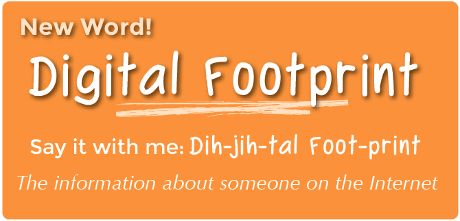
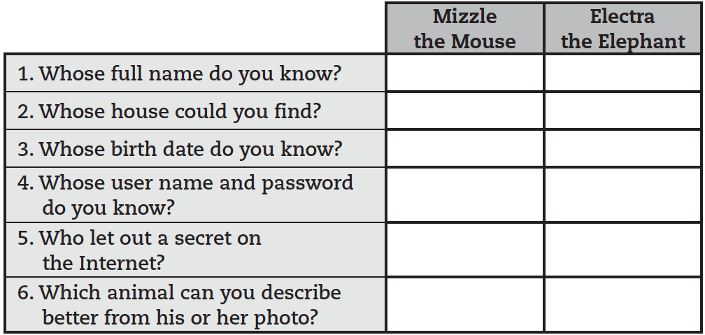

<%= partial('curriculum_header', :title=> 'Your Digital Footprint', :unplugged=>true, :disclaimer=>'Basic lesson time includes activity only. Introductory and Wrap-Up suggestions can be used to delve deeper when time allows.', :time=>30) %>

[content]

[together]

## Lesson Overview
In collaboration with [Common Sense Media](https://www.commonsensemedia.org/educators/scope-and-sequence), 
this lesson helps students learn about the similarities of staying safe in the real world and when visiting websites. Students will also learn that the information they put online leaves a digital footprint or “trail.” This trail can be big or small, helpful or hurtful, depending on how they manage it.

[summary]

## Teaching Summary
### **Getting Started** - 20 minutes

1) [Review](#Review)  
2) [Vocabulary](#Vocab)  
3) [Pause and Think](#GetStarted)  

### **Activity: Follow the Digital Trail** - 30  minutes  

4) [Follow the Digital Trail](#Activity1)  

### **Wrap-up** - 10  minutes 
5) [Flash Chat](#WrapUp) - What did we learn?  
6) [Vocab Shmocab](#Shmocab)

### **Assessment** - 5  minutes 
7) [Digital Footprint Assessment](#Assessment)

[/summary]

## Lesson Objectives 
### Students will:
- Understand that being safe when they visit websites is similar to staying safe in real life
- Learn to recognize websites that are alright for them to visit
- Recognize if they should ask an adult they trust before they visit a particular website
- Explore what information is appropriate to be put online

[/together]

[together]

# Teaching Guide

## Materials, Resources and Prep
### For the Student
- One [Animal Tracks Chart](https://www.commonsensemedia.org/sites/default/files/uploads/classroom_curriculum/k-2-unit2-followthedigitaltrail.pdf) (page 7)
- Pens & Pencils
- [Digital Footprint Assessment](/curriculum/course2/18/Assessment18-DigitalFootprint.pdf)

### For the Teacher
- This Teacher Lesson Guide
- [Download](http://d1pmarobgdhgjx.cloudfront.net/education/pause-think-online-2.mp4) or [prepare](https://www.commonsensemedia.org/videos/pause-think-online) the "Pause and Think" video
- Common Sense Media's [Follow the Digital Trail](https://www.commonsensemedia.org/sites/default/files/uploads/classroom_curriculum/k-2-unit2-followthedigitaltrail.pdf) game 
- Print one set of [Animal Tracks](https://www.commonsensemedia.org/sites/default/files/uploads/classroom_curriculum/k-2-unit2-followthedigitaltrail.pdf) from this PDF
- Print one [Animal Tracks](https://www.commonsensemedia.org/sites/default/files/uploads/classroom_curriculum/k-2-unit2-followthedigitaltrail.pdf) chart (page 7) for each student
- Print one [Digital Footprint Assessment](/curriculum/course2/18/Assessment18-DigitalFootprint.pdf) for each student

[/together]

[together]

## Getting Started (20 min)

###  1) Review
This is a great time to review the last lesson that you went through with your class.  You can do this as one large group or have students discuss with an elbow partner.

Here are some questions that you can ask in review:

- What did we do last time?

- What do you wish we had had a chance to do?

- Did you think of any questions after the lesson that you want to ask?

- What was your favorite part of the last lesson?

[tip]

# Lesson Tip
Finishing the review by asking about the students' favorite things helps to leave a positive impression of the previous exercise, increasing excitement for the activity that you are about to introduce.

[/tip]

###  2) Vocabulary
This lesson has one new and important word: 

[centerIt]

[/centerIt]

**Digital Footprint** - Say it with me: Dih-jih-tal Foot-print  
The information about someone on the Internet

###  3) Pause and Think
- Ask What does it mean to be safe?
- When you walk down the street or play in your neighborhood without a trusted adult there, how do you stay safe?
- Tell students that just as they should stay safe in the real world, they should stay safe when they go into the online world (visiting websites). Make parallels between the answers students gave you about their neighborhood and the online world.

Play [Pause and Think Online](https://www.commonsensemedia.org/videos/pause-think-online) video.

- Introduce the idea that there are three different kinds of websites that students may have the opportunity to visit.
  - Green: A “green” website is:
     - A good site for kids your age to visit
     - Fun, with things for you to do and see
     - Has appropriate words
     - Doesn’t let you talk to people you don’t know
  - Yellow: A “yellow” website is:
     - A site you are not sure is right for you
     - One that asks for information such as who you are, where you live, your phone number or email address, etc.
     - A place where you are allowed to communicate freely with others
  - Red: A “red” website is:
     - A site that is not right for you
     - A place you might have gone to by accident
     - Filled with things that are for older kids or adults
 - Discuss examples of each of these kinds of sites.

[tip]

# Lesson Tip  
If you have access to a computer, feel free to navigate to sites that might showcase each of these types (using extreme caution with your RED selection).

[/tip]
  
Now, let's see what we can do to keep ourselves safe.

[/together]

[together]

## Activities: (20 min)
###  4) [Follow the Digital Trail](https://www.commonsensemedia.org/sites/default/files/uploads/classroom_curriculum/k-2-unit2-followthedigitaltrail.pdf)

- Peruse the [Follow the Digital Trail](https://www.commonsensemedia.org/sites/default/files/uploads/classroom_curriculum/k-2-unit2-followthedigitaltrail.pdf) lesson on the Common Sense Media webpage.
- Give each student an [Animal Tracks Chart](https://www.commonsensemedia.org/sites/default/files/uploads/classroom_curriculum/k-2-unit2-followthedigitaltrail.pdf) (page 7).

**Directions:**

> 1) Place the Digital Trail Squares on the ground, face down, in two different trails, keeping Mizzle the Mouse and Electra the Elephant’s trails separate from one another.

> 2) Share the stories of Mizzle and Electra. These animals decided it would be fun to put some information about themselves online. They went onto www.wildkingdom.com and posted information. The only problem is that they forgot to ask their parents if it was okay first.

> 3) Explain to students that they are from the “Things Big and Small” Detective Agency. An evil hunter has hired them to find out as much as possible about Mizzle the Mouse and Electra the Elephant. The more the detectives learn, the better for their plan to take over the animal kingdom.

> 4) Divide students into groups of four. Tell them that each group should have a detective that will keep detailed notes.

> 5) Invite students to go on a hunt for information. Let them know that the information that Mizzle and Electra post can be seen by anyone, including the detectives. Each group should follow the digital trail of both animals, starting with the mouse and then the elephant. Stagger the groups so they are on the trail at slightly different times. Students should fill out their handout as they go.

[tip]

# Lesson Tip  
For more in-depth modules, you can find additions to this curriculum at the [Common Sense Media](https://www.commonsensemedia.org/educators/scope-and-sequence) page on Scope and Sequence.

[/tip]

[/together]

[together]

## Wrap-up (5 min)
###  5) Flash Chat: What did we learn?
- Who can the detectives find out more about, and why?
- Which animal has a bigger digital footprint?
- Mizzle says some interesting things about himself on the Internet. What are they?
- Is there anything that Electra posted on the Internet that could become a problem for her? If so, what and why?

Take the time to discuss what is appropriate information to share on the Internet, and what is not:

[tip]

# Lesson Tip  
Flash Chat questions are intended to spark big-picture thinking about how the lesson relates to the greater world and the students' greater future.  Use your knowledge of your classroom to decide if you want to discuss these as a class, in groups, or with an elbow-partner.

[/tip]

###  6) Vocab Shmocab
- Which one of these definitions did we learn a word for today?

> "The information about someone on the Internet"  
> "Changing the sun's light to energy"  
> "A person who is under the age of 21" 
>> ...and what is the word that we learned?

[/together]

[together]

## Assessment (5 min)
### 7) [Digital Footprint Assessment](/curriculum/course2/18/Assessment18-DigitalFootprint.pdf)
- Hand out the assessment worksheet and allow students to complete the activity independently after the instructions have been well explained. 
- This should feel familiar, thanks to the previous activities.

[/together]

<!--(this is left in here as an example of how to include an image in Markdown)
 -->

[together]

## Extended Learning 
Use these activities to enhance student learning. They can be used as outside of class activities or other enrichment.

### Common Sense Media

- Visit [Common Sense Media](https://www.commonsensemedia.org/educators/scope-and-sequence) to learn more about how you can keep your students safe in this digital age.
 

[/together]

[standards]

## Connections and Background Information

### ISTE Standards (formerly NETS) 

- 5.a - Advocate and practice safe, legal, and responsible use of information and technology.
- 5.b - Exhibit a positive attitude toward using technology that supports collaboration, learning, and productivity.
- 6.a - Understand and use technology systems.

### CSTA K-12 Computer Science Standards
 
- CI.L1:3-01 - Practice responsible digital citizenship (legal and ethical behaviors) in the use of technology systems and software.
- CPP.L2-06 - Demonstrate good practices in personal information security: using passwords, encryption, secure transactions.

### Common Core Language Arts Standards

- SL.1.1 - Participate in collaborative conversations with diverse partners about grade 1 topics and texts with peers and adults in small and larger groups
- SL.1.2 - Ask and answer questions about key details in a text read aloud or information presented orally or through other media.
- L.1.6 - Use words and phrases acquired through conversations, reading and being read to, and responding to texts, including using frequently occurring conjunctions to signal simple relationships.
- SL.2.1 - Participate in collaborative conversations with diverse partners about grade 2 topics and texts with peers and adults in small and larger groups.
- SL.2.2 - Recount or describe key ideas or details from a text read aloud or information presented orally or through other media.
- L.2.6 - Use words and phrases acquired through conversations, reading and being read to, and responding to texts, including using adjectives and adverbs to describe.
- SL.3.1 - Engage effectively in a range of collaborative discussions (one-on-one, in groups, and teacher-led) with diverse partners on grade 3 topics and texts, building on others' ideas and expressing their own clearly.
- SL.3.3 - Ask and answer questions about information from a speaker, offering appropriate elaboration and detail.
- L.3.6 - Acquire and use accurately grade-appropriate conversational, general academic, and domain-specific words and phrases, including those that signal spatial and temporal relationships.

[/standards]

  

 

 

[/content]

<link rel="stylesheet" type="text/css" href="../docs/morestyle.css"/>
